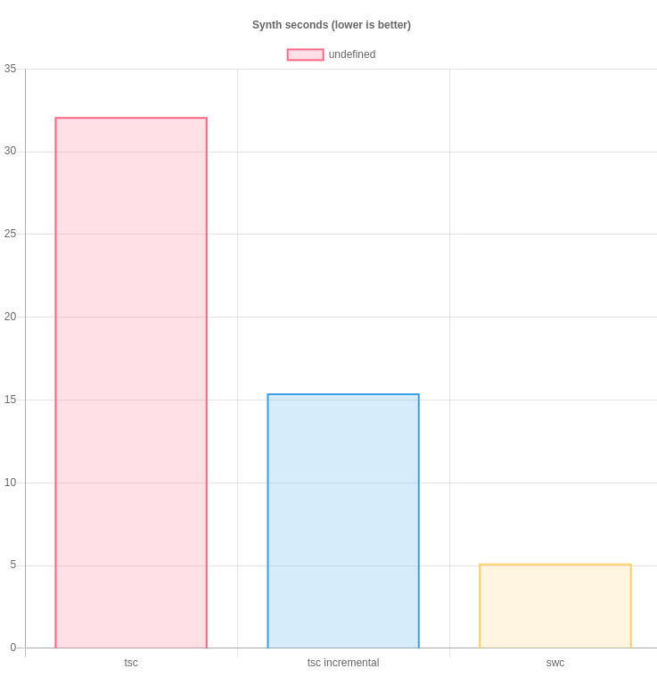
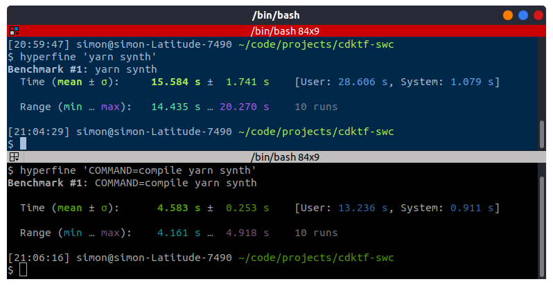

# Setup

SWC is a part of the new generation of js/ts compilers.

In this example it is used with cdktf to improve build times.

- [Setup](#setup)
  - [Conclusion](#conclusion)
  - [Create Project](#create-project)
  - [Setup Resources](#setup-resources)
  - [Start compiling](#start-compiling)
    - [Optimization OPtions](#optimization-options)
      - [Enable incremental ts builds](#enable-incremental-ts-builds)
      - [Use SWC to transpile .ts to commonjs module](#use-swc-to-transpile-ts-to-commonjs-module)


## Conclusion

- Moving from tsc makes transpiling 6x faster
- Type-definitions are lost; this is a WIP for SWC

| Graph compare                         | Benchmark output swc vs. incremental         |
| ------------------------------------- | -------------------------------------------- |
|  |  |


## Create Project

```bash
mkdir cdktf-swc

npx cdktf init --template="typescript" --local
```

## Setup Resources

Follow this tutorial to configure an EC2 instance.

## Start compiling

With this all set up we can run:

```bash
yarn synth
```

This is a little slow:

```bash
time cdktf synth
Generated Terraform code for the stacks: typescript-aws
Done in 32.13s.

real    0m33.510s
user    0m53.192s
sys     0m1.894s
```

### Optimization OPtions

#### Enable incremental ts builds

Stores a build manifest after first build:

```bash
$ time yarn synth
yarn run v1.22.5
$ cdktf synth
Generated Terraform code for the stacks: typescript-aws
Done in 15.45s.

real    0m15.728s
user    0m28.983s
sys     0m1.013s
```

#### Use SWC to transpile .ts to commonjs module

```bash
yarn add --dev @swc/core @swc/cli
```

```js
// .swcrc
{
  "jsc": {
    "parser": {
      "syntax": "typescript"
    },
    "target": "es2018"
  },
  "sourceMaps": true,
  "module": {
    "type": "commonjs",
    "strict": false,
    "noInterop": false,
    "strictMode": false
  }
}
```

```bash
$ time yarn synth
yarn run v1.22.5
$ cdktf synth
Successfully compiled 1 file with swc.

Successfully compiled: 2088 files with swc (681.19ms)

Generated Terraform code for the stacks: typescript-aws
Done in 5.12s.

real    0m5.389s
user    0m16.437s
sys     0m1.046s
```
